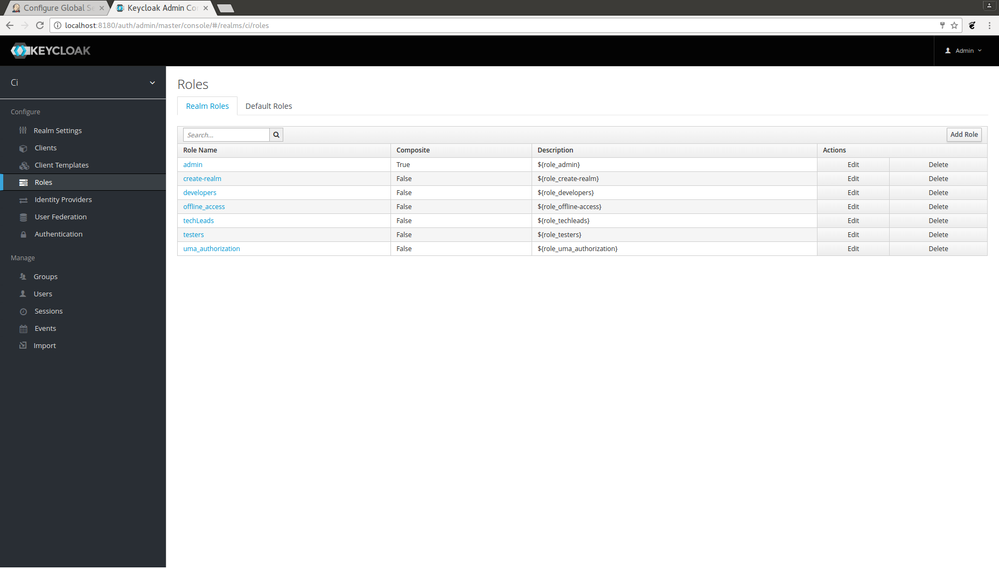
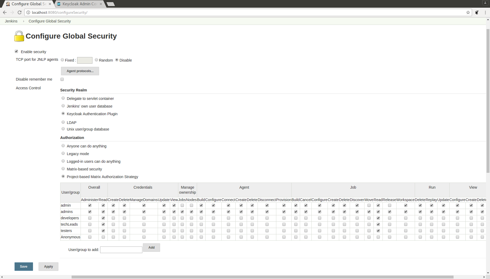

# JenkinsJobs

## Overview

    This document explains how to generate multibranch pipeline jobs, using the JobDSL plugin on a Jenkins instance which is configured to use the Keycloak authentication plugin in conjunction with Project-based Matrix Authorization Strategy  

##  Prerequisites

  See screenshots below for guidance. (Setup may appear slightly different on London Jenkins)

1. Keycloak server setup

2. Roles created on Keycloak which have the same name as their corresponding group on Jenkins. These roles should be assigned via role mappings to similarly named Keycloak groups within the Keycloak realm associated with Jenkins

## Editing the Job DSL groovy script
