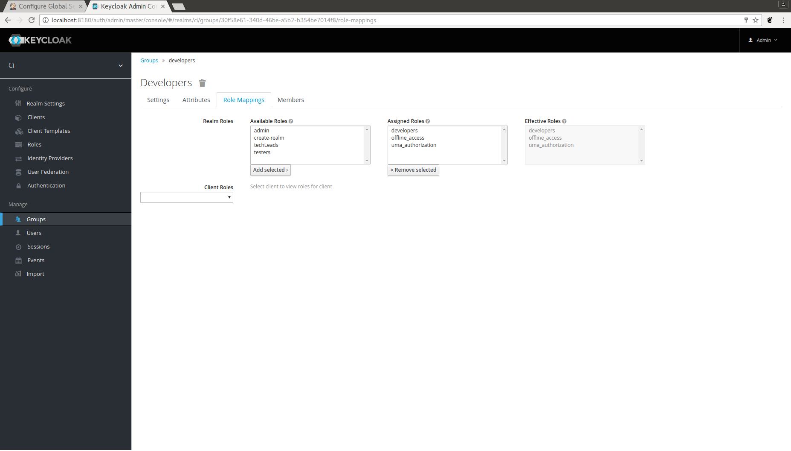

# JenkinsJobs

## Overview

  This document explains how to generate multibranch pipeline jobs using the JobDSL plugin on a Jenkins instance which is configured to use the Keycloak authentication plugin in conjunction with Project-based Matrix Authorization Strategy  

##  Prerequisites

  See screenshots below for guidance. (Setup may appear slightly different on London Jenkins)

1. Keycloak server setup

2. Roles created on Keycloak which have the same name as their corresponding group on Jenkins. These roles should be assigned via role mappings to similarly named Keycloak groups within the Keycloak realm associated with Jenkins

3. JobDSL, Keycloak Athentication and Project Based Matrix Authorization Strategy Jenkins Plugins installed





## Editing the Job DSL groovy script

To define each view and the projects within them change:

```

def blueProjectsjobDefn = 	[
	"Blue Projects"	:	// Each Element is a Entry with Key being the project Name and Value being the Git URL
	[
		"springboot-companies"     	: 	"https://github.com/dogbonnahNB/springboot.git",

  ]
]

def redProjectsjobDefn = 	[
	"Red Projects"	:	// Each Element is a Entry with Key being the project Name and Value being the Git URL
	[
		"DavidIMS"     	: 	"https://github.com/dogbonnahNB/DavidIMS.git",

	]
]

```

This section of code defines the names for two views and the repositories within them. This should be changed to contain the correct view header name. More repositories can be added to the view as demonstrated below:

```
  [
    "DavidIMS"     	: 	"https://github.com/dogbonnahNB/DavidIMS.git",
    "fake-repo"     :   "https://github.com/nonexistantuser/fake-repo.git"  
  ]

```

To set the permissions required for each group in relation to the jobs within a single view, you must create a `List` defining which permissions are required. For each group a `List` of permissions must be defined for each view

```

def testBlueProjectsPermissionsList = ['hudson.model.Item.Delete']
def testRedProjectsPermissionsList = [ 'hudson.model.Item.Read', 'hudson.model.Item.Build', 'hudson.model.Item.Move', 'hudson.model.Item.Discover', ]
def devBlueProjectsPermissionsList = [ 'hudson.model.Item.Workspace', 'hudson.model.Item.Read', 'hudson.model.Item.Configure', 'hudson.model.Item.Delete', 'hudson.model.Item.Cancel', 'hudson.model.Item.Move', 'hudson.model.Item.Discover', 'hudson.model.Item.Create']
def devRedProjectsPermissionsList = [ 'hudson.model.Item.Workspace', 'hudson.model.Item.Read', 'hudson.model.Item.Build', 'hudson.model.Item.Configure', 'hudson.model.Item.Delete', 'hudson.model.Item.Cancel', 'hudson.model.Item.Move', 'hudson.model.Item.Discover', 'hudson.model.Item.Create']

```

Here we have 4 `Lists` - 2 per group. The example code above defines the following:
* Testers group permissions for the Blue Projects View
* Testers group permissions for the Red Projects View
* Developers group permissions for the Blue Projects View
* Developers group permissions for the Red Projects View

For each view, include an `if` block which will add all the defined permissions for a view onto the `PermissionsList`. Each `List` holding permissions for the view should have a `while` loop iterating over it. Give each list a relevant name and stick to a single naming convention to avoid confusion when referring to them later.  

```

if(projectType.equals('blueProject')) {

  while(outerIndex < devBlueProjectsPermissionsList.size())
  {
    String tempString = devBlueProjectsPermissionsList.get(outerIndex)

    permString = tempString + ":" + "developers"
    PermissionsList.add(permString)

    outerIndex++
  }

  outerIndex = 0

  while(outerIndex < testBlueProjectsPermissionsList.size())
  {
    String tempString = testBlueProjectsPermissionsList.get(outerIndex)

    permString = tempString + ":" + "testers"
    PermissionsList.add(permString)

    outerIndex++
  }

}

```

When iterating over a groups permissions for a view, within the `permString` definition, be sure to place the name of the group after the colon exactly as it appears in the Jenkins Authorization Section of Configure Global Security page.

Finally an `each` block should be appended to the groovy script. This block builds each view and the project within it.

```

blueProjectsjobDefn.each { entry ->
  println "View  " + entry.key
	entry.value.each { job ->
        println "Job  " + job.key
		jobName = job.key;
		jobVCS = job.value;
		projectType = 'blueProject';
		buildMultiBranchJob(jobName, jobVCS, projectType)
	}
  listView("${entry.key}") {
    jobs {
      entry.value.each { job ->
        name("${job.key}")
      }
    }
    columns {
        status()
        weather()
        name()
        lastSuccess()
        lastFailure()
        lastDuration()
        buildButton()
    }
  }

}

```
The only parts of this block that ought to be different is the variable representing the view's name which in the below example is `blueProjectsjobDefn` and the `projectType` assignment which should be the same as what is defined in its corresponding if statement:

```
if(projectType.equals('blueProject'))

```

## Creating the Seed Job in Jenkins

To create the seed job create a new freestyle job in Jenkins and within the Source Code Management section insert the name of the repository containing your groovy script.


Scroll down the page to the Build section and select Add build step > Process Job DSLs


If configured correctly your seed job should run successfully and generate views with the defined projects within them.
